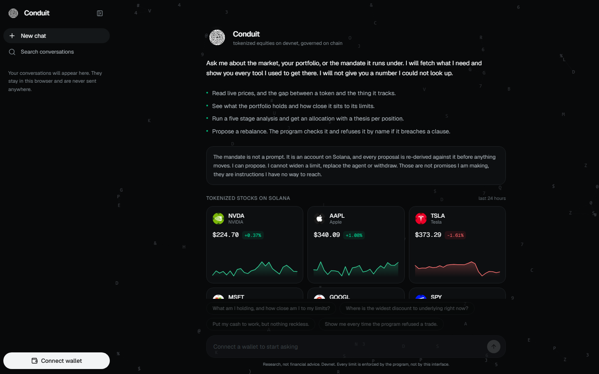
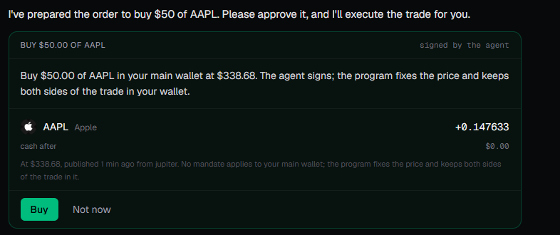
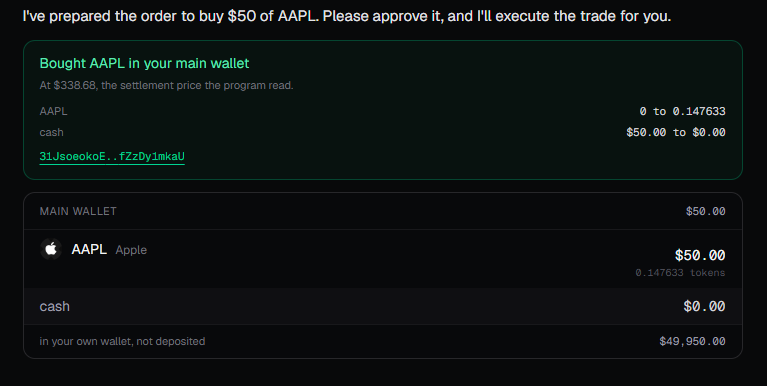
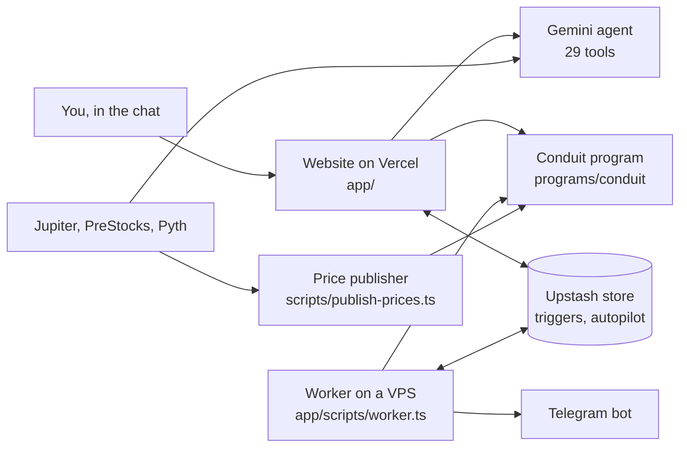

# Conduit

**Invest in stocks the way you text a friend. Type "buy $50 of Apple" or "buy $20 of NVIDIA every 10 minutes", and an AI agent does it on Solana, inside limits that a Solana program enforces and the agent cannot change.**

[Live app](https://ai-conduit.vercel.app) · [Program on Solana Explorer](https://explorer.solana.com/address/6X7wfnLNHQvW94CHPVFdguraojh5uEN3Y1gjfi2pkxVu?cluster=devnet) · [A refusal on chain](https://explorer.solana.com/tx/4uo7FtZtCNurZRmQ6sn5F64n8H7wEJRDUPq8BKtadjqsNBcXfbAviwkWSPpcNvQWwus1EmeiHdu17UJaHPiRFmmF?cluster=devnet) · [Proof table](#proof-you-can-click)



Built for **Stocklana** (Solana Foundation) with **PreStocks** and **Pyth**. Tokenized stocks, crypto and pre IPO companies, all in one conversation.

---

## The problem

Trading apps are built like airplane cockpits: order tickets, charts, tabs, and panels stacked on top of each other. Someone who wants "a bit more Apple" has to learn the whole cockpit first, and many never do.

That same person already sends dozens of messages a day to friends and family. Messaging is the one interface nobody has to learn.

So we asked two questions:

1. **What if investing felt like sending a message?** No new screens to learn. You say what you want, in your own words, and get a clear card back to approve.
2. **What if the assistant could keep working after you close the tab,** buying on a schedule, watching a price, rebalancing a portfolio, **without asking you to trust it blindly?**

The second question is the hard one. An AI that can move money is only useful if it cannot misuse that power. Conduit's answer: **the AI never holds the rules.** The rules live in a Solana program, and the program checks every move the AI makes.

## What you can say to it

Everything below is a real message you can type in the live app. Anything that moves money comes back as a card you approve with one tap.

| You type | What happens |
|---|---|
| `how is NVIDIA doing?` | A stock brief: price, the day's move, a 24 hour chart, and the headlines behind it |
| `buy $50 of Apple` | An approval card with the exact tokens you get and the on chain price. Tap Buy and it settles in seconds |
| `in 2 minutes, buy $50 of AAPL` | A timed order: it waits, then buys at that moment's price |
| `buy $20 of AAPL every 10 minutes` | A repeating order. The card shows the most it can ever spend ($200 over 10 runs) |
| `every 10 minutes, if NVDA is above $150, buy $100 of it` | A price rule checked on a schedule |
| `when NVDA rises 2.5%, message me and buy $500` | A price trigger, reported on Telegram when it fires |
| `put $5,000 to work, max 30% in any stock, keep 10% cash` | A **mandate**: your rules, written into a Solana account you sign |
| `analyze NVDA, TSLA and SpaceX` | A five stage AI committee (Research, Bull, Bear, Risk, Manager) proposes a split, with a reason per position |
| `put it on autopilot, keep pre IPO under 10%` | The agent runs the portfolio on its own, on a schedule, within the mandate |
| `how am I doing against the market?` | A scorecard against simply holding SPY |
| `link my Telegram` | Every trade, trigger and autopilot decision reaches your phone |





## Why this needs Solana

Conduit is not a chatbot bolted onto a brokerage. **The Solana program is the trust boundary.** If you remove it, the product stops being safe to automate.

- **The limits are an account, not a prompt.** A mandate stores its limits on chain: largest position, minimum cash, maximum turnover per rebalance, maximum number of assets, and the only assets allowed. The agent's one power over a mandate is `propose_rebalance`, and the program re-checks every limit before accepting it. A breach fails with the exact rule that was broken, for example [`PositionExceedsMaxSize`](https://explorer.solana.com/tx/4uo7FtZtCNurZRmQ6sn5F64n8H7wEJRDUPq8BKtadjqsNBcXfbAviwkWSPpcNvQWwus1EmeiHdu17UJaHPiRFmmF?cluster=devnet).
- **The agent can act without a wallet popup, and still cannot escape.** From your main wallet, money can only go three places: to the trading desk at the on chain price, into your own mandates, or back to you. Pulling money *out* of a mandate is `move_from_mandate`, and the program allows **only the owner** to sign it. If the agent could do that, it could move cash out of the rules and trade it freely, so it is blocked by the program, not by a promise.
- **The agent never sets a price.** `trade` and `settle` read the price from an account bound to each asset. The caller cannot choose it, prices older than 10 minutes are refused, and rounding always goes against the wallet, never the desk.
- **Fast, cheap transactions make per trade enforcement practical.** Every order, every trigger run and every autopilot cycle is its own checked transaction. A 7 asset settlement fits in one transaction through an [address lookup table](https://explorer.solana.com/address/2Pdn523kthmjy6zqEuGwGcVHxRrzZSmGgLj85zEbxUVM?cluster=devnet) of 58 addresses.

## Sponsor integrations

| Technology | Role in Conduit | Where |
|---|---|---|
| **PreStocks** | The whole pre IPO sleeve: 8 companies, their prices, and a trading strategy built on the gap between token price and company mark | [`app/src/lib/prestocks.ts`](app/src/lib/prestocks.ts), [`app/src/lib/autopilot/pre-ipo.ts`](app/src/lib/autopilot/pre-ipo.ts) |
| **Pyth** | Crypto prices for the agent (Hermes), a native on chain Pyth price parser in the program, and the feed id that identifies every asset | [`app/src/lib/pyth.ts`](app/src/lib/pyth.ts), [`programs/conduit/src/settlement.rs`](programs/conduit/src/settlement.rs) |
| **Solana** (Anchor) | The rule keeper: 16 instructions, 28 named errors, custody and settlement | [`programs/conduit/src/`](programs/conduit/src/) |
| Jupiter | Real xStock trade prices for the 7 tokenized equities | [`app/src/lib/jupiter.ts`](app/src/lib/jupiter.ts) |

### PreStocks: a strategy, not a price list

PreStocks publishes two prices for each private company: `tokenPrice`, what the token trades at, and `markPrice`, what the company exposure behind it is valued at. Conduit treats the gap between them as the signal. The autopilot **buys** a name trading 10% or more below its mark, **adds nothing** to one 15% or more above, **trims** one 30% or more above, and caps the whole pre IPO share of the portfolio (10% by default). On devnet it did exactly that: it bought SpaceX at $116.99 against a $148.81 mark (21% below) and stayed out of OpenAI at a 31% premium, then settled on chain in [mandate `65rLrw95...`](https://explorer.solana.com/address/65rLrw95HrPPqAnmDobG1qkG1cLjQwRaWKRMukhJeJiz?cluster=devnet). All 8 pre IPO names come from the PreStocks API, and **no other pre IPO issuer is integrated anywhere**.

### Pyth: built into the price layer

Every asset in the registry is identified by its Pyth feed id, and the program's price reader (`price_from` in [`lib.rs`](programs/conduit/src/lib.rs)) decides who to trust **by who owns the price account**. An account owned by the Pyth receiver is parsed natively (`read_price`, tested against a real 134 byte devnet Pyth account). An account written by Conduit's publisher is read as a published price. Anything else is refused with `UnknownPriceSource`. Moving an asset onto a live Pyth feed is therefore a registry change, not a code change. In the app, Pyth Hermes prices the crypto sleeve (BTC, ETH, SOL) for the agent, with a server side proxy so the API key never reaches the browser.

**A note on entitlements.** Pyth's equity feeds refused our key with `Not entitled` (a commercial tier), and a batch containing one refused feed fails completely. So [`pyth.ts`](app/src/lib/pyth.ts) retries feeds one by one to isolate the refusal, and the equity sleeve moved to Jupiter's real xStock trade prices. We checked the two sources against each other on TSLA, the one equity feed we could read: Pyth said 376.17, Jupiter said 376.30, about 3.5 basis points apart.

## How it works



1. **You type.** The chat streams your message to `/api/chat`, where a Gemini agent picks from 29 tools (prices, wallet, orders, mandates, analysis, triggers, autopilot, Telegram).
2. **Anything that moves money becomes a card.** Nothing runs until you tap approve.
3. **The program checks it.** A trade, a proposal or a settlement is a Solana transaction that the program accepts or refuses by name.
4. **The worker keeps going when you leave.** Every minute it checks triggers and due autopilot cycles, and it reports each outcome to Telegram.
5. **Prices stay fresh on chain.** The publisher writes all 18 prices every 4 minutes, because the program refuses anything older than 10.

<details>
<summary><b>The Solana program: 16 instructions</b></summary>

| Job | Instructions |
|---|---|
| Mandates | `initialize_mandate`, `initialize_portfolio`, `set_mandate_status` (pause, resume, close) |
| The agent's one power over a mandate | `propose_rebalance` |
| Making an approved allocation real | `settle` (the portfolio is valued from actual token balances, at on chain prices) |
| Main wallet | `open_wallet`, `trade`, `withdraw` |
| Moving money | `move_to_mandate` (owner or agent), `move_from_mandate` (**owner only**), `withdraw_from_mandate` (to the owner only) |
| Prices and desk | `initialize_desk`, `register_desk_asset`, `initialize_publisher`, `publish_price` |

28 error codes (6000 to 6027), one per rule, so every refusal names the rule it broke. Program id `6X7wfnLNHQvW94CHPVFdguraojh5uEN3Y1gjfi2pkxVu` on devnet.
</details>

<details>
<summary><b>The autopilot, and the safety brake</b></summary>

- **The committee.** Research reads the market. Bull and Bear argue opposite sides **at the same time and never see each other's answer**, so the manager gets two independent views, not a compromise. Risk applies the limits, and the Portfolio Manager decides. Every stage's output is schema checked, and the Gemini client falls back through a model ladder when a model fails ([`gemini.ts`](app/src/lib/gemini.ts)).
- **The brake.** If the portfolio falls a set amount from its best point (10% by default), the autopilot moves toward cash and stops itself. Proven live: tripped, moved to cash in 2 transactions, paused.
- **The scorecard.** Performance against simply holding SPY, with deposits and withdrawals kept out of the result.
</details>

<details>
<summary><b>Triggers: price, timed and repeating</b></summary>

One engine in [`app/src/lib/triggers/`](app/src/lib/triggers/) handles all of these:

- **Price:** rise or fall by a percent, or cross a price.
- **Timed:** "in 2 minutes". The clock starts at your approval.
- **Repeating:** every N minutes, with or without a price rule, capped at a run count. The approval card shows the most it can spend.

Safety rules: a trigger is claimed before it trades, so it can never fire twice. A failed trade stops a repeating order instead of retrying it every interval. After downtime the schedule restarts from now, with no burst of catch up trades.
</details>

## Proof you can click

| What | Evidence |
|---|---|
| The live app | [ai-conduit.vercel.app](https://ai-conduit.vercel.app) |
| The deployed program | [`6X7wfnLN...`](https://explorer.solana.com/address/6X7wfnLNHQvW94CHPVFdguraojh5uEN3Y1gjfi2pkxVu?cluster=devnet) |
| A main wallet trade, signed by the agent | [`48ymYD9C...`](https://explorer.solana.com/tx/48ymYD9C5gQiigMnQv8Z5WBU9vw2pgmu5m6y22wAEnyg4aLCbwdn88ybvFwbbHvpphYHNGLCMWTYkNmtrHd8faqc?cluster=devnet) |
| A rebalance the program accepted | [`3PY2rYUh...`](https://explorer.solana.com/tx/3PY2rYUhtiWCPrR6gdiDpdALHMbKDKMDUbrNxCFryUgmBRuo458mYATepv7UdWZ5GaY6KW4Wx3h4CPNvsP8igxfb?cluster=devnet) |
| A rebalance the program **refused** (`PositionExceedsMaxSize`) | [`4uo7FtZt...`](https://explorer.solana.com/tx/4uo7FtZtCNurZRmQ6sn5F64n8H7wEJRDUPq8BKtadjqsNBcXfbAviwkWSPpcNvQWwus1EmeiHdu17UJaHPiRFmmF?cluster=devnet) |
| A settlement into real token balances | [`5pW7hZTR...`](https://explorer.solana.com/tx/5pW7hZTRtGwUjZfy8eV9R4h4AULmMR3LVC1K9wk1XTxvbH6Wm2KJrQZCyRVajnNSwCKstfh7happWWPVPLzjDYNF?cluster=devnet) |
| Money moved into a mandate | [`3XHLZZgB...`](https://explorer.solana.com/tx/3XHLZZgBvg5LbDKeS8DCgQP7RaydW7Nz2zoZNMgzt7u3WYkhagmjonDgnMM3sMvx8VtatoP2vkv6yYpVUWvxMFCe?cluster=devnet) |
| A withdrawal from a mandate back to its owner | [`62LRLWRh...`](https://explorer.solana.com/tx/62LRLWRhoBZ2DkxkfFgdDwt43fXvCr9pWhQxFgspajZNhhkVNmNRHkPwjKYTc81SEk8pP9CUVgm42Gq2ts3mWJcj?cluster=devnet) |
| The pre IPO autopilot mandate (SpaceX bought below mark) | [`65rLrw95...`](https://explorer.solana.com/address/65rLrw95HrPPqAnmDobG1qkG1cLjQwRaWKRMukhJeJiz?cluster=devnet) |

## Tested, and every failure closed

**392 automated tests**, all passing at their last full run: 53 Rust unit tests (policy, settlement arithmetic, the Pyth parser), 77 TypeScript integration tests against the live devnet program (including balances checked on both sides of a settlement), and 262 app tests (rerun today, 25 September).

On top of that, **56 recorded test runs with 715 hand checks**, many of them live on devnet, in Chrome, and against the deployed site. They found **107 failures, and all 107 are closed.** Some of what they caught:

| Run | What it proved or caught |
|---|---|
| Wallet and RPC proxy | The RPC proxy refuses 6 kinds of bad request, including a blocked method hidden inside a batch. The built browser bundle was scanned: the Pyth key, the Gemini key and the RPC URL are all absent |
| Proposal review | A value could silently encode as zero, and the agent was ignoring the turnover limit. Both fixed before a judge could meet them |
| A stranger's wallet, start to finish | A brand new wallet got demo cash, created a mandate, rebalanced and settled into AAPL, NVDA and TSLA |
| Pre IPO strategy, live | The first live cycle hit Solana's transaction size limit (1333 of 1232 bytes). Fixed with the lookup table, then the second cycle settled with no manual step |
| Safety brake, live | The first trip failed to move to cash. Fixed, retried, and it tripped, went to cash in 2 transactions and paused itself |
| Timed and repeating triggers | Your exact sentences pick the right tool: "in the next 2 minutes, buy $50 worth of appl" becomes a timed order, not an immediate buy |

## Try it

**On the live app (about 2 minutes):**

1. Install Phantom and switch it to **Devnet** (Settings, Developer settings). Get a little free devnet SOL at [faucet.solana.com](https://faucet.solana.com) for the few steps you sign yourself.
2. Open [ai-conduit.vercel.app](https://ai-conduit.vercel.app) and connect.
3. Type `give me demo cash`, then `open my main wallet`, then `deposit $1,000`.
4. Type `buy $50 of Apple`, then tap Buy.
5. Try `buy $5 of AAPL every 2 minutes, 2 times`, or `put it on autopilot`.

**Locally:**

```bash
git clone https://github.com/MikeMoulder/Conduit.git && cd Conduit/app
cp .env.example .env     # fill in the keys below
npm install
npm run agent:keypair    # creates the agent key and writes it to .env
npm run dev              # http://localhost:3000
npm test                 # 262 app tests
```

Requires Node 20.6 or later. The program is already deployed on devnet, so the app runs against it as is.

| Variable | What it is | Where to get one |
|---|---|---|
| `GEMINI_API_KEY` | The agent's model | [aistudio.google.com/apikey](https://aistudio.google.com/apikey), free |
| `PYTH_API_KEY` | Hermes prices for crypto | [pythdata.app](https://pythdata.app), free |
| `AGENT_SECRET_KEY` | The agent's signing key | `npm run agent:keypair` |
| `FAUCET_SECRET_KEY` | Pays the fees for agent signed actions, and hands out demo cash | Any devnet keypair with a little SOL covers fees. Demo cash comes only from our faucet, so the full money flow is quickest on the live app |
| `SOLANA_RPC_URL` | Devnet RPC | The public endpoint works; a dedicated one is faster |
| `TELEGRAM_BOT_TOKEN`, `FINNHUB_API_KEY`, `UPSTASH_*` | Optional: bot, company news, shared store | Without Upstash, a local JSON file is used |

## What is real, what is not

**Real, on Solana devnet:** the program and every rule it enforces, the agent's trades, rebalances, settlements and refusals (linked above), the autopilot, the brake, triggers, and Telegram delivery. The site runs on Vercel, and the background worker and price publisher run on our server.

**Devnet stand ins, disclosed:** the 7 stock tokens and 8 pre IPO tokens you hold are devnet SPL mints that Conduit issued, one per real asset, because the real xStock and PreStocks tokens exist only on mainnet. The mainnet mint each one mirrors is recorded in [`registry.devnet.json`](app/src/lib/registry.devnet.json) as `mainnetMint`. **Their prices are real:** Jupiter's live xStock trades and PreStocks' live API.

**A trusted publisher, disclosed:** the on chain prices that settlement uses are written by one publisher key, because Pyth's equity feeds are a paid tier and pre IPO companies have no public market for an oracle to observe. That key is **not** the agent's key, and the agent has no instruction that can write a price. The program already reads Pyth accounts natively, so each asset can move to a Pyth feed with a registry change.

## Limitations and next

- **Devnet only.** No real money, no mainnet deployment, no audit.
- **The rebalance endpoint is open.** Harmless on devnet, because no caller can exceed a mandate. On mainnet it should require the owner's signature.
- **One worker process.** If the server reboots, the worker needs a manual restart.
- **To use the chat you need a devnet wallet.** Read only questions without a wallet are next.

**Next:** move the equity prices onto Pyth feeds as entitlements allow, point the registry at the real mainnet mints (the PreStocks mainnet tokens use Token-2022), and add owner signed proposals.

**Vision (not built):** the familiar chat on a phone, where a family's savings run on autopilot and every limit they set is guaranteed by a program instead of a company's promise.

---

Built for Stocklana, September 2026. Open source components: Next.js, Anchor, Solana web3.js, wallet adapter, zod, lucide icons.
